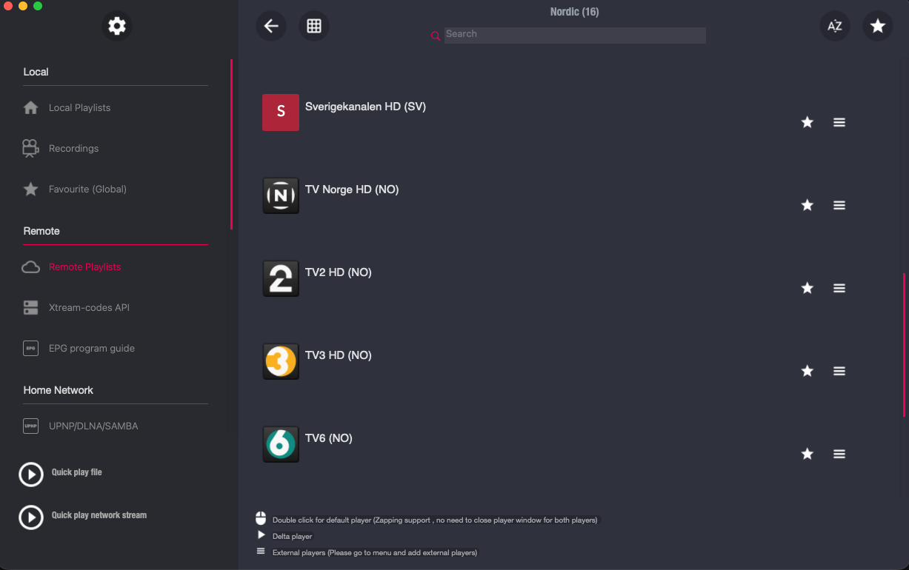

# GSE SMART IPTV for Mac OSX (macOS)

Complete **GSE SMART IPTV 4.4** apps for Apple Silicon and Intel Macs, with compatibility fixes for playlist navigation, startup on macOS 27, and the reported EPG update crash.

**No playlists are included.** Channels shown in the screenshot are illustrative; add your own playlists. Downloads contain no personal accounts, settings or EPG databases. Existing local playlists and settings are preserved when upgrading.

## Download and install

Choose your Mac's architecture from [Releases](https://github.com/Delitants/gse-smart-iptv-macos-compat/releases/latest):

- **Apple Silicon:** `macosx` archive ending in `arm64.zip`.
- **Intel:** `macosx` archive ending in `x86_64.zip`.

Quit GSE and back up your current app. Unzip the download, then copy **GSE SMART IPTV.app** to **Applications**. Checksums are provided in `SHA256SUMS`.

These apps are locally signed, not Apple-notarized. Use macOS's normal per-app approval if prompted.

Tested on Apple Silicon; Intel tests ran under Rosetta. Physical Intel hardware and prolonged playback remain untested.

Independent compatibility release. The [MIT license](LICENSE) covers compatibility source only; the original app retains its existing rights.
